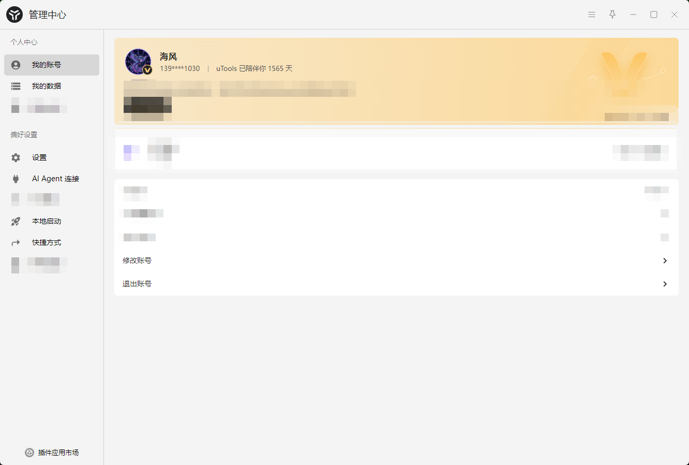
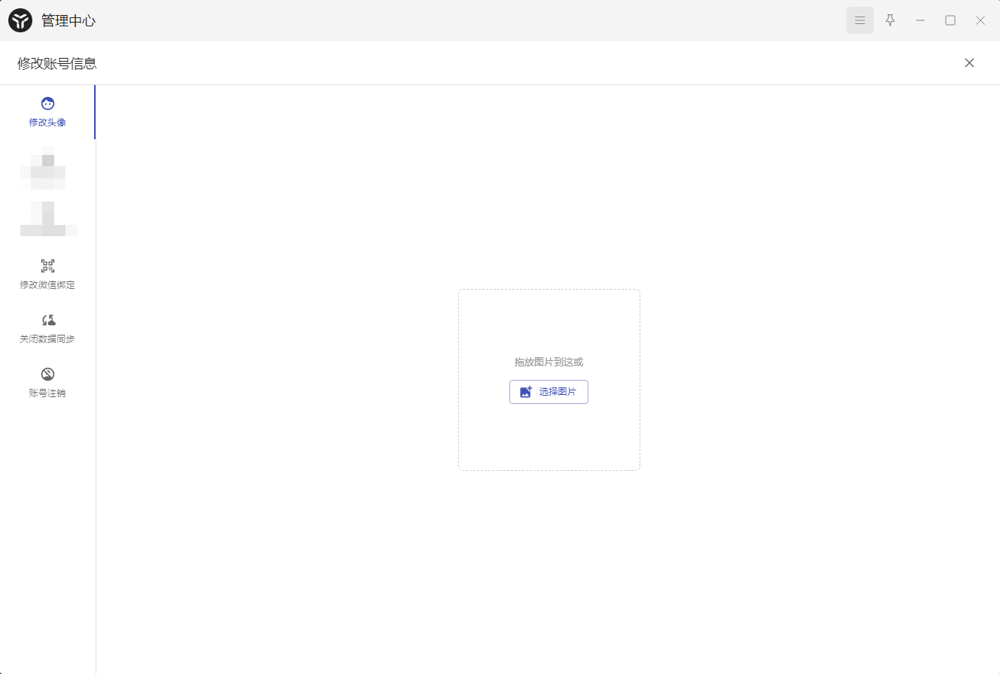
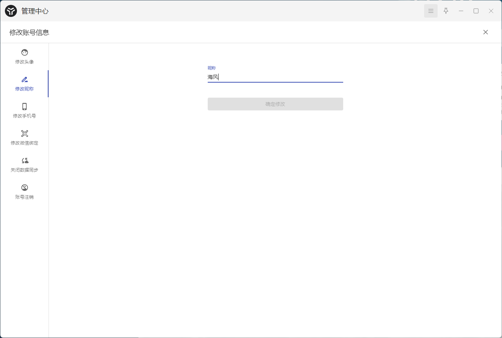
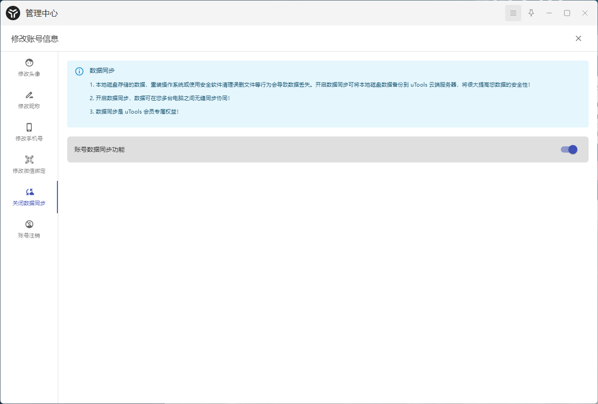
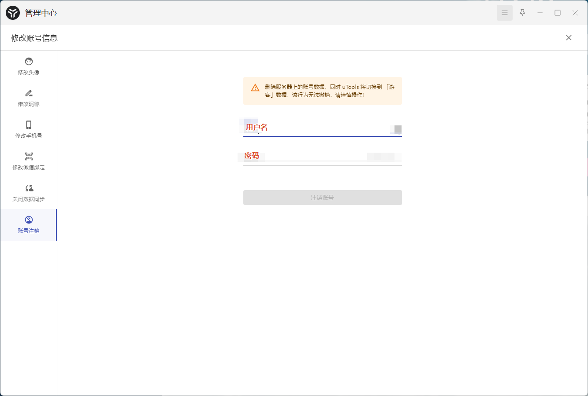
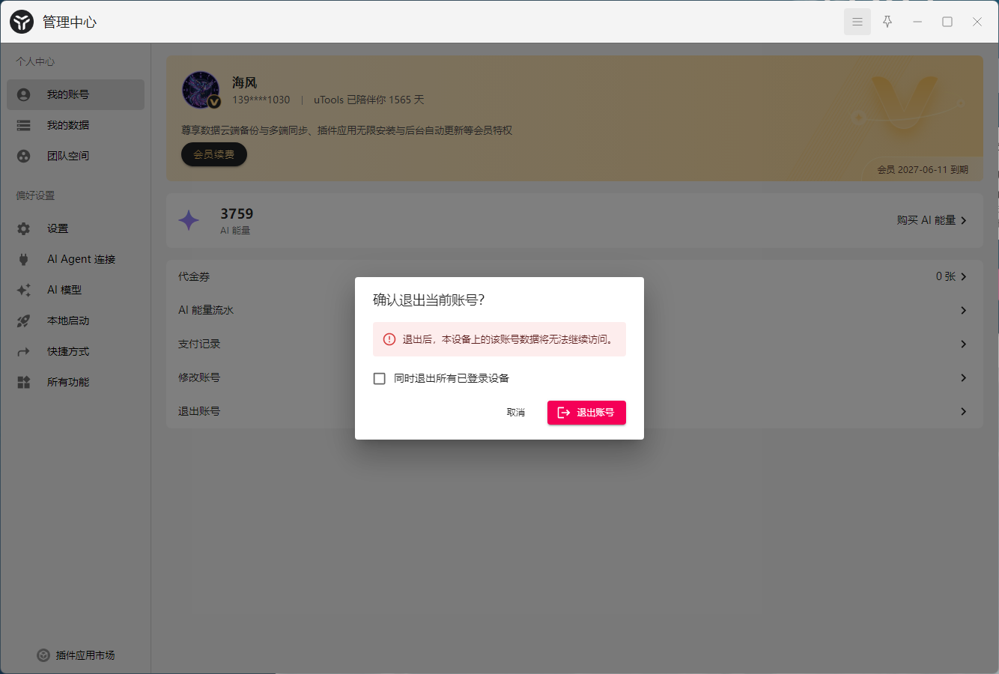
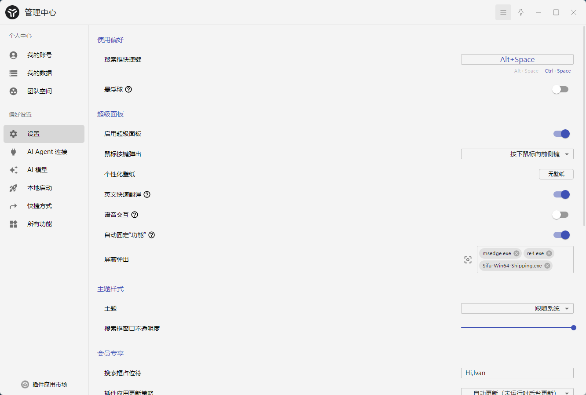
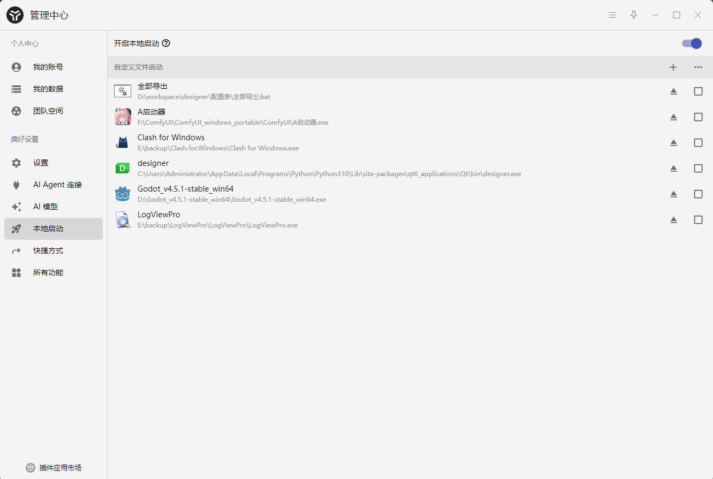

# 管理中心界面结构
## 左侧导航栏
### 个人中心
- 我的账号
- 我的数据

### 偏好设置
- 设置
- AI Agent连接
- 本地启动
- 所有功能

### 底部
插件市场按钮

## 右侧内容区域

## 管理中心界面结构效果图

# 个人中心

## 首页
- 顶部区域:用户头像，用户名称，陪伴时间，背景图片
- 中间列表区域:修改账号，退出账号

### 效果图

## 修改账号页面

### 左侧导航栏
- 修改头像
- 修改昵称
- 关闭数据同步
- 账号注销

#### 效果图

### 右侧内容区
- 修改头像 效果图

- 修改昵称 效果图

- 关闭数据同步 效果图

- 账号注销 效果图

## 退出账号页面
效果图

# 我的数据(暂时不做，等做好了插件功能以后再做)

## 设置内容页面

### 使用偏好
- 搜索框快捷键

### 主题样式
- 主题:跟随系统，亮色，暗色
- 背景图:启用背景图，清除背景图，不透明度，暗化
- 背景:不透明度，暗化

### 高级设置
- 搜索框占位符
- 开机启动
- 分离独立窗口快捷键:默认ctrl+d
- 自动清除搜索框时间:立即，1分钟/2分钟/3分钟-10分钟，从不

### 网络 · 同步服务器（只读）
- 同步服务器地址：**只展示当前实际生效的地址**，并写明它是谁定的（环境变量 `ITOOLS_SYNC_ENDPOINT` / 你在账号页填的 / 开发模式默认的 `127.0.0.1:8787` / 尚未接入云端）
- 「去账号页修改」按钮：跳到「我的账号 → 修改账号 → 数据同步」
- **本页不放第二个输入框**：地址的唯一编辑入口在账号页。两处输入框必然不同步，比没有更糟
- 环境变量指定时不给跳转按钮（跳过去也改不动，不做假入口）

### 网络 · 代理
- 启用代理（开关）：开启后 iTools 的出站请求经该代理，关闭则全部直连
- 代理地址（输入框）
- 「测试」按钮：用**输入框里填的这个地址**发起一次真实请求，回报是否真的经过了代理、目标与耗时；地址为空时按钮禁用并说明原因
- 说明块三个：作用范围（哪些流量会走代理）/ 本地地址一律直连（硬规则）/「测试」按钮的准确语义（测通 ≠ 流量在走代理）

> **历史订正**：本版本之前这一组是**存了不生效**的假控件——开关与地址只写进 `settings.json`，后端没有任何一处读取，所有出站请求一律直连，界面上只用「（演示）」两字带过。这是撞诚信红线的缺陷，**本版本已真实接入**。确切行为（作用范围 / 绕过规则 / 支持的地址形态）以 `doc/插件系统/插件分发规范.md` 8.8 为准。

### 效果图

# AI Agent连接(暂时不做，后续规划)

# 本地启动
## 功能
- 开启本地启动(开关按钮)
- 自定义文件启动:点击+按钮->下拉菜单(选择文件，选择文件夹)，弹出系统文件选择框选择文件或文件夹进行添加。或者手动拖动文件或文件夹到内容区域添加。注意：不限制文件格式，支持任意文件类型
- 文件列表:支持删除列表内容，支持单个删除或者批量删除
### 效果图

# 所有功能(暂时不做，后续规划)
# 插件市场(暂时不做，后续规划)